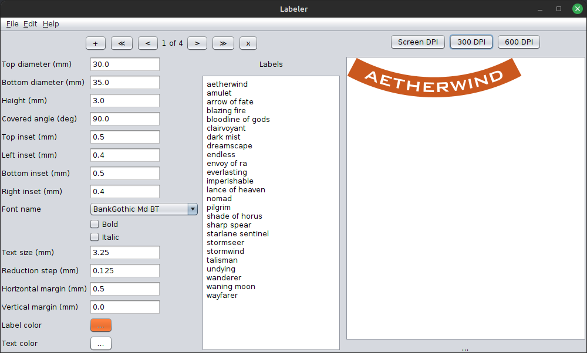
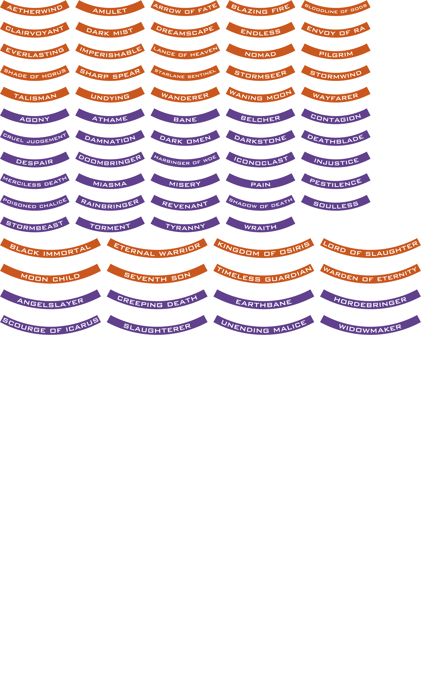

# Labeler
Creating labels for miniature bases.

## Sample project

Designing and printing is quite easy. The hardest part is dealing with the printer getting stuck (I use 120g self adhesive matte paper), and cutting out the labels using scissors. :)

## Parameters

### Dropfleet Commander

#### Small Base

Top diameter 30, Bottom diameter 35, Height 3, Covered angle 90, Top inset 0.5, Left inset 0.4, Bottom inset 0.5, Right inset 0.4, Font name BankGothic Md BT, Text size 3.25, Reduction step 0.125, Horizontal margin 0.5, Vertical margin 0.0.

#### Large Base

Top diameter 45, Bottom diameter 50, Height 3, Covered angle 90, Top inset 0.5, Left inset 0.4, Bottom inset 0.5, Right inset 0.4, Font name BankGothic Md BT, Text size 3.5, Reduction step 0.125, Horizontal margin 0.5, Vertical margin 0.0.
